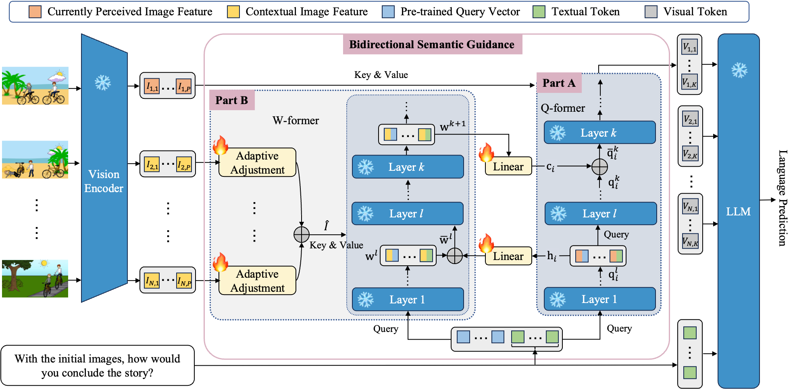
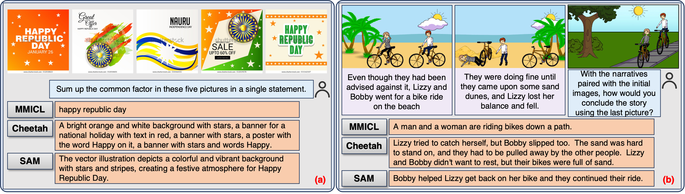

<h1 align = "center">
Semantic Alignment for Multimodal Large Language Models
</h1>
<div align='center'>
  Tao Wu<sup>1,*</sup>, Mengze Li<sup>1,*</sup>, Jingyuan Chen<sup>1</sup>, Wei Ji<sup>2</sup>, Wang Lin<sup>1</sup>, Jinyang Gao<sup>3</sup>, Kun Kuang<sup>1</sup>, Zhou Zhao<sup>1</sup>, Fei Wu<sup>1</sup>
</div>

<div align='center'>
  <sup>1</sup> Zhejiang University  &nbsp;&nbsp;&nbsp;
                      <sup>2</sup> National University of Singapore &nbsp;&nbsp;&nbsp;
                      <sup>3</sup> Alibaba Group
</div>

<div align='center'>
  <sup>*</sup>Equal Contribution. <sup>&dagger;</sup>Corresponding Authors
</div>


## SAM model

The core mechanism of our SAM model is the **Bidirectional Semantic Guidance** mechanism with two interactive processes: 

* **Assisted Visual Token Extraction** (Part A) 
* **Contextual Semantic Generation** (Part B)

In the Assisted Visual Token Extraction process, the Q-former module leverages the contextual semantics from other images in the multi-modal instruction to guide the extraction of visual tokens from the currently  perceived image features.

During the Contextual Semantic Generation phase, the W-former module is utilized to select the contextual semantics from the visual context of contextual images (*i.e.*, images other than the currently perceived image). This selection process is facilitated by the attention mechanism in the adaptive adjustment and the Q-former module, with assistance from the visual tokens extracted from the currently perceived images.



## Cases

SAM demonstrates strong abilities to perform group captioning and storytelling tasks. In **(a)**, SAM can identify commonalities between images accurately, while other MLLMs' answers either show weak instruction-following ability or contain redundancy and hallucinations. In **(b)**, while other MLLMs might treat the storytelling task as an image captioning task, SAM successfully discovers the correlation between the characters in the images and matches them with the names of the characters in the text, creating a coherent story.





## Getting Started

**1. Installation**

Git clone our repository and creating conda environment:

```bash
conda create -n sam python=3.8
conda activate sam
pip install -e .
```

**2. Prepare Model Weights**

The current version of SAM supports Vicuna-7B  as the language model. Please first follow the [instructions](https://huggingface.co/lmsys/vicuna-7b-v1.1) to prepare Vicuna-v1.1 7B weights. 

Then modify the ```llm_model``` in the [sam/configs/models/sam.yaml](sam/configs/models/sam.yaml#L26) to your vicuna 7b model path.

Then download SAM weights from [Google Drive](https://drive.google.com/file/d/1_HwvTmE9ZJoK7KHuA-maP7YD_jRWArde/view?usp=drive_link), and modify the ```ckpt``` in the [sam/configs/models/sam.yaml](sam/configs/models/sam.yaml#L13) to your SAM checkpoint path.

**3. Inference**

```
python inference.py
```

**4. Test**

Firstly download test dataset. Download link:

* [Google Drive](https://drive.google.com/drive/folders/1iBmnAgQeJcrzjRuf-opy_YLa-8wAZBku?usp=drive_link)

We only provide AESOP, VIST and Conceptual datasets since the original datasets have been made public. 

For Animal and Vehicle dataset, please obtain the original dataset from [https://nico.thumedialab.com/](https://nico.thumedialab.com/).

For DM800K dataset, please obtain the original dataset from [https://github.com/jingqiangchen/ConCaps](https://github.com/jingqiangchen/ConCaps).

Once you have obtained the original dataset containing images, feel free to contact us via email (twu22@zju.edu.cn) for textual annotations.

Once the datasets are prepared, run the following command:

```
python test.py -d your_dataset_path -s save_path
```

**5. Evaluation**

First install the `rouge` and `coco` package through pip:

```
pip install rouge
pip install "git+https://github.com/salaniz/pycocoevalcap.git"
```

Then run the following command:

```
python evaluate_score.py --result-dir save_path
```

**6. Training**

Feel free to contact us via email (twu22@zju.edu.cn) for training code and training dataset. It is highly recommended that you include your personal information, such as your name and contact details, when contacting us via email.

## Acknowledgment

We've built upon the [LAVIS](https://github.com/salesforce/LAVIS/tree/main) library by Salesforce for the development of our code.